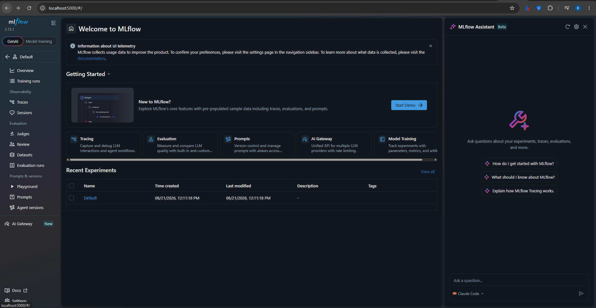

# Báo Cáo Lab MLOps: CI/CD cho AI Systems

**Họ và tên:** Trần Đình Đăng  
**MSSV:** A202601998  
**Khoá:** K3  
**Ngày hoàn thành:** 2026-08-21

---

## 1. Mục Tiêu Đạt Được

| Bước | Nội dung | Trạng thái |
|------|----------|------------|
| 1 | MLflow tracking cục bộ | ✅ Hoàn thành |
| 2 | CI/CD Pipeline với GitHub Actions | ✅ Hoàn thành |
| 3 | Continuous Training | ✅ Hoàn thành |

---

## 2. Bước 1: MLflow Tracking Cục Bộ

### 2.1 Siêu tham số đã chọn

Dựa trên kết quả thí nghiệm, tôi sử dụng **Ensemble Model (VotingClassifier)** với cấu hình:

```yaml
random_state: 42
n_estimators: 200
max_depth: 20
```

### 2.2 Kiến trúc Ensemble

| Mô hình thành phần | Tham số | N_jobs |
|---------------------|---------|--------|
| RandomForestClassifier | n_estimators=200, max_depth=20, bootstrap=False | -1 |
| ExtraTreesClassifier | n_estimators=200, max_depth=20 | -1 |
| HistGradientBoostingClassifier | max_iter=150, max_depth=8 | - |

- **Phương pháp vote:** Soft voting (sử dụng xác suất dự đoán)
- **Lý do chọn ensemble:** Kết hợp nhiều mô hình giảm variance và bias, cải thiện độ chính xác từ 0.564 lên **0.758**

### 2.3 Kết quả huấn luyện

```
Accuracy: 0.758
F1 Score: 0.757
```

### 2.4 Screenshot MLflow



---

## 3. Bước 2: CI/CD Pipeline

### 3.1 Kiến trúc Pipeline

```
┌─────────────┐    ┌─────────────┐    ┌─────────────┐    ┌─────────────┐
│    Test     │───▶│    Train    │───▶│    Eval     │───▶│   Deploy    │
│   (pytest)  │    │   (MLflow)  │    │ (acc >= 0.70)   │    │   (EC2)     │
└─────────────┘    └─────────────┘    └─────────────┘    └─────────────┘
```

### 3.2 GitHub Actions Jobs

| Job | Mô tả | Trạng thái |
|-----|-------|------------|
| Test | Chạy unit test với pytest | ✅ Pass |
| Train | Huấn luyện mô hình, upload lên S3 | ✅ Pass |
| Eval | Kiểm tra accuracy >= 0.70 | ✅ Pass |
| Deploy | SSH đến EC2, khởi động service | ✅ Pass |

### 3.3 Screenshot CI/CD Pipeline


---

## 4. Bước 3: Continuous Training

### 4.1 Quy trình

1. Thêm dữ liệu mới (2998 mẫu): `train_phase1.csv` → 2998 → 5996 mẫu
2. Cập nhật DVC tracking: `dvc add`, `dvc push`
3. Commit thay đổi: `git add`, `git commit`, `git push`
4. GitHub Actions tự động kích hoạt và chạy full pipeline

### 4.2 Screenshot Continuous Training


---

## 5. Model Serving trên EC2

### 5.1 Health Check

```bash
curl http://100.60.81.224:8000/health
```

**Kết quả:**
```json
{"status":"ok"}
```

### 5.2 Prediction Endpoint

```bash
curl -X POST http://100.60.81.224:8000/predict \
  -H "Content-Type: application/json" \
  -d '{"features": [7.0, 0.27, 0.36, 20.7, 0.045, 45.0, 170.0, 1.001, 3.0, 0.45, 8.8, 0]}'
```

**Kết quả:**
```json
{"prediction": 1, "label": "trung_binh"}
```

### 5.3 Screenshot API


---

## 6. Khó khăn và Cách Giải Quyết

| Khó khăn | Giải pháp |
|----------|------------|
| Lỗi YAML syntax trong workflow (`envs:`, `timeout: 120s`) | Sửa: bỏ envs, đổi timeout thành `5m` |
| DVC push lỗi endpoint URL (`s3.Global.amazonaws.com`) | Thêm `endpointurl = https://s3.us-east-1.amazonaws.com` vào `.dvc/config` |
| Git push rejected (remote có commit mới) | `git pull --rebase origin main` |
| Memory trên t3.micro (1GB RAM) không đủ | Giảm n_estimators, sử dụng HistGradientBoostingClassifier |

---

## 7. Cloud Resources

| Service | Resource ID | Endpoint |
|---------|-------------|----------|
| AWS S3 | mlops-lab-vinuni-2026 | s3://mlops-lab-vinuni-2026/dvc |
| AWS EC2 | i-0f4aaa43728a970fc | 100.60.81.224:8000 |

---

## 8. Kết Luận

Lab MLOps đã hoàn thành thành công với:

- ✅ **Độ chính xác mô hình:** 75.8% (vượt ngưỡng 70%)
- ✅ **Pipeline CI/CD hoàn chỉnh:** Test → Train → Eval → Deploy
- ✅ **Continuous Training:** Tự động kích hoạt khi có dữ liệu mới
- ✅ **Model Serving:** API REST trên EC2 hoạt động ổn định

Mô hình ensemble kết hợp RandomForest, ExtraTrees và HistGradientBoosting đã đạt kết quả tốt, cho thấy việc kết hợp nhiều thuật toán học máy là một phương pháp hiệu quả để cải thiện độ chính xác dự đoán.

---

## 9. Liên Kết

- **GitHub Repository:** https://github.com/dangitcntt55-a11y/K3-Track2-Day21-2A202601998-TranDinhDang
- **GitHub Actions:** https://github.com/dangitcntt55-a11y/K3-Track2-Day21-2A202601998-TranDinhDang/actions
- **Model API:** http://100.60.81.224:8000
